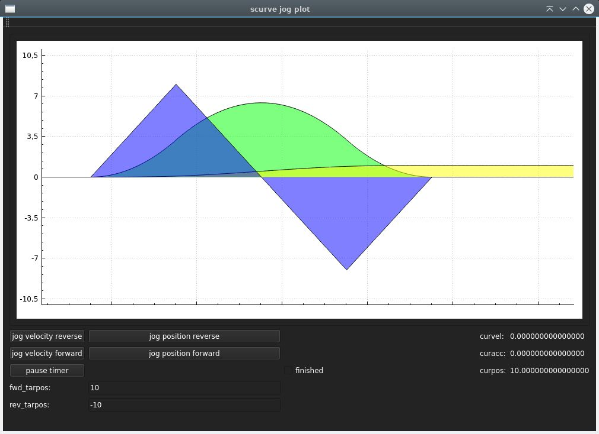
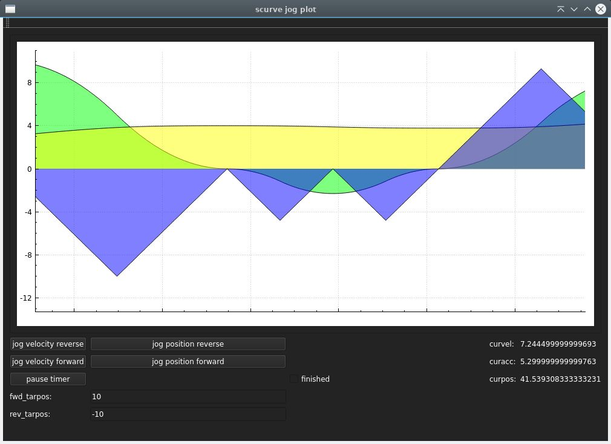

### scurve_motion Library

position control

velocity control


### Overview

The `scurve_construct` library is a C++ library designed for jogging and position control applications with S-curve motion profiles. It enables smooth acceleration and deceleration for precise and controlled motion.

### Features

- S-curve motion profiling for smooth jogging.
- Jerk limited.
- Support for both forward and reverse jogging.
- Linear acceleration stage between concave & convex curve depending on jerk value.
- Gui project to preview curve outputs in a qt-realtime-plot.
- Velocity control.
- Position control.

### Language

C & C++.

### Example for c

```
#include "scurve_construct.h" 

double jermax=5;
double maxacc=5;
double maxvel=10;
double intval=0.001;
struct scurve_data data;
 
while(!s.finish){
	s=set_init_values_c(jermax,maxacc,maxvel,intval,s);
	s=jog_position_c(s,enable,tarpos); 		// Use position control.
    // s=jog_velocity_c(s,enable,tarpos); 	// Use velocity control.
	s=scurve_play_c(s);
    
	// Results:
	s.guiacc
	s.guipos
	s.guivel
}
 
```

### Prerequisites

- CMake (version 3.5 or higher)
- C++ compiler

### Building

```bash
mkdir build
cd build
cmake ..
make
