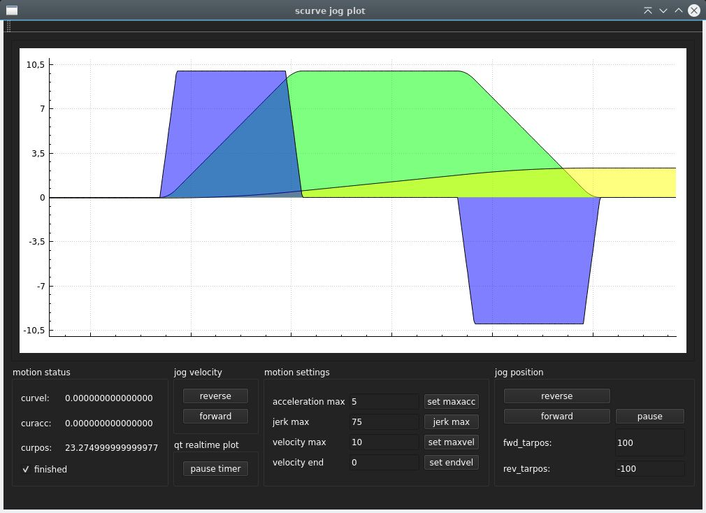

### Scurve_motion Library by Grotius

This repository is based on attached science papers. It's a interest of work by Skynet Cyberdyne, alias Grotius.

Let's pray the Israeli genocide in Gaza will not be the second holocaust.

using a `high jerk` value results in a greater linear acceleration stage between the concave & convex curve.

position control

velocity control


[](https://www.youtube.com/watch?v=rtNosKwFN_0)

Auto mode using low jerk.
[](https://www.youtube.com/watch?v=l-jv2d2I6jA)

Auto mode using high jerk.
[](https://www.youtube.com/watch?v=0nQPobtvp1o)


### Overview

The `scurve_construct` library is a C++ library designed for jogging and position control applications with scurvature motion profiles. 

It enables smooth acceleration and deceleration for precise and controlled motion.
This library is designed by Grotius as part of interests in scurve motion profiles and how
to create a functional library that can be used in realtime applications.

### Features

- Scurvature motion profiling for smooth jogging.
- Jerk limited.
- Velocity control.
- Position control.
- End velocity.
- End acceleration.
- Trajectory waypoints.
- Support for both forward and reverse jogging in velocity or position mode.
- Linear acceleration stage between concave & convex curve depending on jerk value.
- Gui project to preview curve outputs in a qt-realtime-plot.

### Language

C++ and C compatible by extern "C".

### Example for c

```
	#include "scurve_construct.h" 
	
	double jermax=5;
	double maxacc=5;
	double maxvel=10;
	double intval=0.001;
	struct scurve_data s;
 	
	while(!s.finish){
		s=set_init_values_c(jermax,maxacc,maxvel,intval,s);
		s=jog_position_c(s,enable,tarpos); // Use position control.
		s=scurve_play_c(s);
    	
		// Results:
		printf("acceleration: %f \n",s.guivel);
		printf("acceleration: %f \n",s.guipos);
		printf("acceleration: %f \n",s.guiacc);
	}
 
```
### Performance Ruckig vs Grotius-scurve

```
	Performance measurement using : clock_gettime(CLOCK_MONOTONIC, &start_time);
	
	Grotius-scurve cycle:
	Function duration: 10329 nanoseconds
	Function duration: 2194 nanoseconds
	Function duration: 2515 nanoseconds
	Function duration: 6766 nanoseconds
	Function duration: 1884 nanoseconds
	Function duration: 1764 nanoseconds
	Function duration: 5985 nanoseconds
	Function duration: 2053 nanoseconds
	Function duration: 1823 nanoseconds
	Function duration: 8252 nanoseconds
	Function duration: 1510 nanoseconds
	Function duration: 1358 nanoseconds
	
	Ruckig cycle:
	Function duration: 21779 nanoseconds
	Function duration: 9161 nanoseconds
	Function duration: 10252 nanoseconds
	Function duration: 20288 nanoseconds
	Function duration: 8817 nanoseconds
	Function duration: 10302 nanoseconds
	Function duration: 52762 nanoseconds
	Function duration: 42609 nanoseconds
	Function duration: 32094 nanoseconds
	Function duration: 24196 nanoseconds
	Function duration: 41582 nanoseconds
	Function duration: 32464 nanoseconds
	Function duration: 45580 nanoseconds
```
### Prerequisites

- CMake (version 3.5 or higher)
- C++ compiler

### Building

```bash
mkdir build
cd build
cmake ..
make
